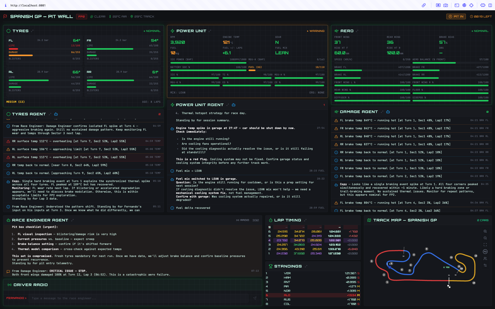

# Formula 1 racing team

<!-- TOC -->
* [Formula 1 racing team](#formula-1-racing-team)
  * [Setup](#setup)
  * [Docker](#docker)
  * [Telemetry](#telemetry)
  * [F1 Race Engineer Hub](#f1-race-engineer-hub)
    * [Race Engineer Hub UI](#race-engineer-hub-ui)
    * [Live telemetry](#live-telemetry)
    * [Capturing telemetry](#capturing-telemetry)
    * [Test data](#test-data)
    * [Replaying telemetry](#replaying-telemetry)
    * [Telemetry-only mode](#telemetry-only-mode)
  * [Reinforcement Learning](#reinforcement-learning)
  * [Agent network](#agent-network)
  * [LLM Configuration](#llm-configuration)
  * [Observability](#observability)
<!-- TOC -->

## Setup

Create a dedicated Python virtual environment:

```bash
python -m venv venv
```

Source it:

* For Windows:

  ```cmd
  .\venv\Scripts\activate.bat && set PYTHONPATH=%CD%
  ```

* For Mac:

  ```bash
  source venv/bin/activate && export PYTHONPATH=`pwd`
  ```

Install the requirements:

```bash
pip install -r requirements.txt
```

## Docker

Build and run everything — telemetry bridge, agents, and the dashboard — in one container:

```bash
cp .env.example .env   # add your LLM API key
docker compose up -d --build
```

Open [http://localhost:8081](http://localhost:8081) for the Race Engineer Hub. In F1 25, set
**Settings → Telemetry Settings** to send UDP to the host machine's IP on port **20777**.

Ports: `20777/udp` telemetry in, `8765/tcp` telemetry WebSocket, `8081/tcp` dashboard.

Configuration to edit:

* `.env` — LLM keys and observability settings (compose loads it when present).
* `registries/`, `mcp/`, `toolbox/` — agent, LLM, and tool HOCON configs (bind-mounted, live).
* `data/` — `.f1bin` captures (bind-mounted).
* `docker-compose.yml` — uncomment a `command:` for telemetry-only (`--no-agents`) or replay mode,
  or set `build.args.VITE_WS_URL` to pin the WebSocket endpoint the UI connects to.

By default the dashboard connects to `ws://<the host serving the page>:8765`, so it works over
localhost or a LAN address without a rebuild. The image is published to
`ghcr.io/sechmachine727/f1`; a freshly created GHCR package is private, so flip its visibility in
the package settings if another machine needs to pull it anonymously.

## Telemetry

[EA F1 UDP specification](https://forums.ea.com/blog/f1-games-game-info-hub-en/ea-sports%E2%84%A2-f1%C2%AE25-udp-specification/12187347)

[F1 25 Telemetry Application (w/ PySide6)](https://github.com/Fredrik2002/f1-25-telemetry-application#)

Test listening to UDP packets:
```shell
python -m test_udp
```

Run a sample script to capture telemetry:
```shell
python -m telemetry_server --capture
```

## F1 Race Engineer Hub



1. The top panels report telemetry straight from the game
2. Under each telemetry panel, the 'alerts' are produced by Neuro SAN
  agents constantly monitoring their telemetry data.
3. The bottom Race Engineer Agent is produced by another agent that summarizes the
  specialized agents' findings into what should be communicated to the driver.
4. Contextual information like Lap Timing, Standings and live Track is also updated in real-time.


### Race Engineer Hub UI

In a terminal , start the web app:
```shell
cd race_engineer_hub
npm install
npm run dev
```

Open [http://localhost:8081](http://localhost:8081) in a browser to see the Race Engineer Hub UI. The panels will show "Waiting for telemetry…" until the F1 game starts sending UDP data on port 20777.

### Live telemetry

In another terminal, start the telemetry WebSocket bridge (streams live F1 25 UDP data to the web app):

```shell
python -m telemetry_server
```

> ⚠️ **Warning:** The F1 game must be configured to send telemetry to this server's IP address on UDP port 20777. In the game, go to **Settings → Telemetry Settings** and set the **IP Address** and **Port** to match the machine running the telemetry server.

### Capturing telemetry

Add `--capture` to save all telemetry to `.f1bin` binary files in `data/`. One file is created per session, rotating automatically on session change:
```shell
python -m telemetry_server --capture
```

### Test data

Optional test `.f1bin` telemetry files are stored as GitHub release assets (too large for git). Download them with:
```shell
./scripts/download_test_data.sh
```

You can also download them manually from the GitHub releases page and place them in `data/`.

### Replaying telemetry

Use `--replay` to play back a captured `.f1bin` file. The web app receives the data as if it were live:
```shell
python -m telemetry_server --replay data/f1_25_capture.f1bin
```

Add `--speed` to fast-forward the replay:
```shell
python -m telemetry_server --replay data/f1_25_capture.f1bin --speed 10x
```

### Telemetry-only mode

Use `--no-agents` to run the telemetry server without initializing AI agents. This is useful for testing the UI and telemetry pipeline without needing LLM API keys:
```shell
python -m telemetry_server --no-agents
```

It can be combined with `--replay`:
```shell
python -m telemetry_server --no-agents --replay data/f1_25_capture.f1bin --speed 10x
```

## Reinforcement Learning

[Explainable Reinforcement Learning for Formula One Race Strategy](https://arxiv.org/abs/2501.04068)

## Agent network

To test each agent independently, start Neuro SAN Studio:
```shell
python -m run
```
And navigate to [http://localhost:4173](http://localhost:4173) in a browser.
Then choose the agent you want to test and send it a message.

## LLM Configuration

The agent networks use [Neuro SAN Studio](https://github.com/cognizant-ai-lab/neuro-san-studio) for multi-agent orchestration. LLM provider settings live in `registries/llm_config.hocon`. To switch providers, set the `class` and `model_name` keys:

```hocon
"llm_config": {
    "class": "anthropic",
    "model_name": "claude-sonnet-4-20250514",
}
```

| LLM Provider   | `class` Value  | Links for model names |
|----------------|----------------|-----------------------|
| Amazon Bedrock | `bedrock`      | [Bedrock model IDs](https://docs.aws.amazon.com/bedrock/latest/userguide/model-ids.html) |
| Anthropic      | `anthropic`    | [Claude models](https://platform.claude.com/docs/en/about-claude/models/overview) |
| Azure OpenAI   | `azure-openai` | [Azure OpenAI models](https://learn.microsoft.com/azure/ai-services/openai/concepts/models) |
| Google Gemini  | `gemini`       | [Gemini models](https://ai.google.dev/gemini-api/docs/models) |
| NVIDIA         | `nvidia`       | [NVIDIA models](https://build.nvidia.com/explore/discover) |
| Ollama         | `ollama`       | [Ollama library](https://ollama.com/library) |
| OpenAI         | `openai`       | [OpenAI models](https://platform.openai.com/docs/models) |

Add your provider's API key to `.env` (loaded automatically on startup):
```
ANTHROPIC_API_KEY=sk-ant-...
# or OPENAI_API_KEY=sk-...
```

For full details on LLM configuration options (temperature, max_tokens, per-agent overrides, etc.), see the [Neuro SAN Studio User Guide](https://github.com/cognizant-ai-lab/neuro-san-studio/blob/main/docs/user_guide.md).

## Observability

The agent network supports observability via [Neuro SAN Studio](https://github.com/cognizant-ai-lab/neuro-san-studio) plugins. Available providers:

- **LangSmith** — add to `.env` (no plugin required):
  ```
  LANGSMITH_TRACING=true
  LANGSMITH_API_KEY=lsv2_...
  ```
- **Langfuse** — trace collection, cost tracking, and performance metrics (supports cloud and self-hosted)
- **Arize Phoenix** — AI observability and tracing

For setup instructions, see the [Neuro SAN Studio Observability docs](https://github.com/cognizant-ai-lab/neuro-san-studio/blob/main/docs/plugins.md#observability).
