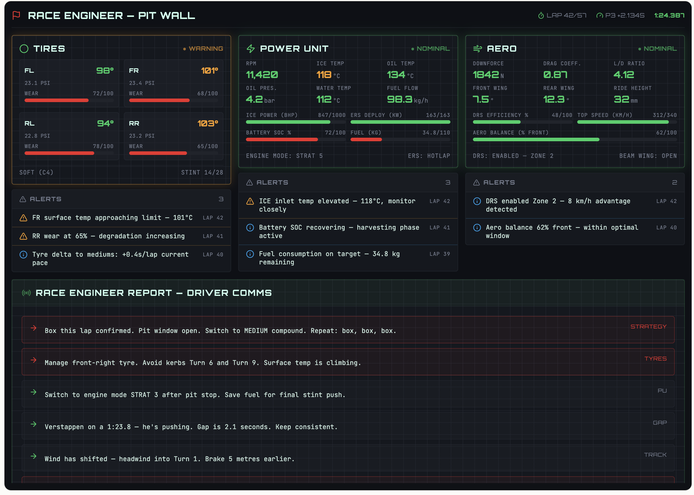

# Formula 1 racing team

## Setup

Create a dedicated Python virtual environment:

```bash
python -m venv venv
```

Source it:

* For Windows:

  ```cmd
  .\venv\Scripts\activate.bat && set PYTHONPATH=%CD%
  ```

* For Mac:

  ```bash
  source venv/bin/activate && export PYTHONPATH=`pwd`
  ```

Install the requirements:

```bash
pip install -r requirements.txt
```

## Agent network

Start a Neuro SAN race engineer agent network:
```shell
python -m run
```

## Telemetry

[EA F1 UDP specification](https://forums.ea.com/blog/f1-games-game-info-hub-en/ea-sports%E2%84%A2-f1%C2%AE25-udp-specification/12187347)

[F1 25 Telemetry Application (w/ PySide6)](https://github.com/Fredrik2002/f1-25-telemetry-application#)

Test listening to UDP packets:
```shell
python -m test_udp
```

Run a sample script to capture telemetry:
```shell
python -m lag_logger
```

## Reinforcement Learning

[Explainable Reinforcement Learning for Formula One Race Strategy](https://arxiv.org/abs/2501.04068)

## F1 Race Engineer Concept



1. The top 3 panels report telemetry straight from the game.
2. Under each telemetry panel, the 'alerts' are produced by Neuro SAN
  agents constantly monitoring their telemetry data.
3. The bottom part is produced by another agent that summarizes the
  specialized agents' findings into what should be communicated to the driver.
